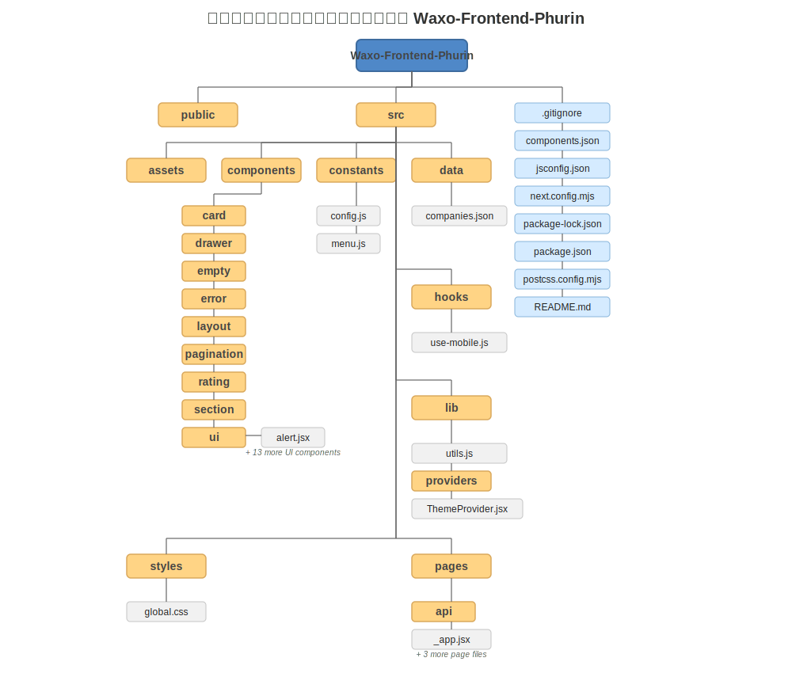
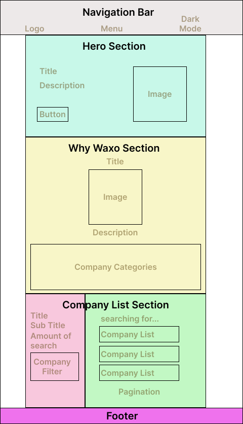
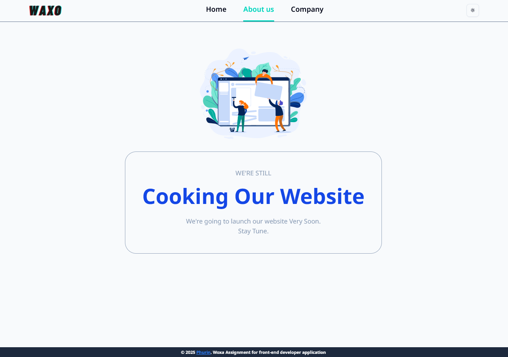

# Waxo App - บริการรีวิวบริษัทด้านการเงิน


แพลตฟอร์มสำหรับการค้นหาและเปรียบเทียบรีวิวบริษัทด้านการเงิน Fintech, โบรกเกอร์ และผู้ให้บริการชำระเงิน เพื่อช่วยผู้ใช้ตัดสินใจเลือกใช้บริการอย่างมั่นใจ

## สารบัญ

- [การติดตั้งและเริ่มต้นใช้งาน](#การติดตั้งและเริ่มต้นใช้งาน)
- [โครงสร้างโปรเจค](#โครงสร้างโปรเจค)
- [เทคโนโลยีที่ใช้และเหตุผล](#เทคโนโลยีที่ใช้และเหตุผล)
- [คุณสมบัติเด่น](#คุณสมบัติเด่น)
- [ผู้พัฒนา](#ผู้พัฒนา)

## การติดตั้งและเริ่มต้นใช้งาน

### ขั้นตอนการติดตั้ง

1. ติดตั้งโปรเจคโดยการ unzip ไฟล์ที่แนบไป หรือโคลนจาก github repository

```bash
git clone https://github.com/phurinler/woxa-frontend-phurin.git
cd woxa-frontend-phurin
```

2. ติดตั้ง dependencies

```bash
npm install
```

3. Run โปรเจค

```bash
npm run dev
```

4. เข้าถึงเว็บไซต์ได้ที่ [http://localhost:3000](http://localhost:3000)

## โครงสร้างโปรเจค



### คำอธิบาย

```
Woxa-Frontend-Phurin/
│
├── public/                     # เก็บ assets แบบ public
│
├── src/                        # ไฟล์ข้อมูลโปรเจค
│   │
│   ├── assets/                 # เก็บ assets แบบ private
│   │
│   ├── components/             # เก็บ React components
│   │   │
│   │   ├── card/              # เก็บ card component
│   │   │   └── CompanyCard.jsx    # แสดง company card รายละเอียดโดยย่อยของบริษัท
│   │   │
│   │   ├── drawer/            # เก็บ company drawer component
│   │   │   └── CompanyDrawer.jsx  # แสดง modal รายละเอียดเพิ่มเติมจาก card
│   │   │
│   │   ├── empty/             # เก็บ empty state component
│   │   │   ├── EmptyAlert.jsx     # แสดง Alert ว่า ไม่พบข้อมูลที่ค้นหา
│   │   │   └── EmptyPage.jsx      # แสดงหน้าเพจแบบ empty กำลังอยู่ในขั้นตอนสร้าง
│   │   │
│   │   ├── error/             # เก็บ error state component
│   │   │   └── ErrorAlert.jsx     # แสดง Alert แบบเกิดข้อผิดพลาดในการหาข้อมูล
│   │   │
│   │   ├── layout/            # เก็บ Interface layout component
│   │   │   ├── index.jsx          # แสดง layout ที่รวบรวมทั้ง Footer และ Navbar
│   │   │   │
│   │   │   ├── Footer/           # เก็บ footer component
│   │   │   │   └── index.jsx        # แสดงเนื้อหาด้านล่างสุดของเว็บไซต์
│   │   │   │
│   │   │   └── Navbar/           # เก็บ navbar component
│   │   │       ├── index.jsx        # แสดง navbar component ที่รวบรวม page link และ sidebar menu
│   │   │       ├── PageLink.jsx     # แสดงเมนูต่างๆบน navbar
│   │   │       └── SidebarMenu.jsx  # แสดงเมนูจากด้านข้าง สำหรับหน้าจอขนาดเล็ก
│   │   │
│   │   ├── pagination/        # เก็บ pagination component
│   │   │   └── ListPagination.jsx  # แสดง pagination ควบคุมรายการต่อหนึ่งหน้า
│   │   │
│   │   ├── rating/            # เก็บ rating component
│   │   │   └── StarRating.jsx     # แสดงคะแนนเฉลี่ยจากรีวิวโดยใช้ badge component
│   │   │
│   │   ├── section/           # เก็บ section component ต่างๆ
│   │   │   ├── HeroSection.jsx    # แสดงคอนเทนท์แนะนำ Waxo App เป็นส่วนแรกของหน้า Home
│   │   │   ├── WhyWaxoSection.jsx # แสดงคอนเทนท์ประสบการณ์ Waxo App เป็นส่วนที่สองของหน้า Home
│   │   │   │
│   │   │   └── CompanyListSection/  # เก็บ company list section
│   │   │       ├── index.jsx          # รวบรวม company filter และ company list เป็นส่วนที่สามของหน้า Home
│   │   │       ├── CompanyFilter.jsx  # แสดง section ฝั่งซ้าย ฟอร์มสำหรับ filter
│   │   │       └── CompanyList.jsx    # แสดง section ฝั่งขวา รายการบริษัทที่ค้นหา
│   │   │
│   │   └── ui/                # เก็บ reusable component จาก shadcn/ui
│   │       ├── alert.jsx          # alert component
│   │       ├── badge.jsx          # badge component
│   │       ├── button.jsx         # button component
│   │       ├── card.jsx           # card component
│   │       ├── drawer.jsx         # drawer component
│   │       ├── input.jsx          # input component
│   │       ├── label.jsx          # label component
│   │       ├── pagination.jsx     # pagination component
│   │       ├── separator.jsx      # separator component
│   │       ├── sheet.jsx          # sheet component
│   │       ├── sidebar.jsx        # sidebar component
│   │       ├── skeleton.jsx       # skeleton component
│   │       ├── toggle.jsx         # toggle component
│   │       └── tooltip.jsx        # tooltip component
│   │
│   ├── constants/             # เก็บตัวแปรหรือค่า config ต่างๆ
│   │   ├── config.js             # เก็บค่า config ต่างๆ
│   │   └── menu.js               # เก็บ menu ที่นำไปแสดงบน navbar
│   │
│   ├── data/                  # เก็บข้อมูลต่างๆ
│   │   └── companies.json        # เก็บข้อมูลรายการของบริษัทต่างๆ
│   │
│   ├── hooks/                 # เก็บฟังก์ชั่นแบบ hook
│   │   └── use-mobile.js         # ฟังก์ชั่นสำหรับเช็คขนาดหน้าจอว่าเป็น mobile หรือไม่
│   │
│   ├── lib/                   # เก็บ utility functions, helpers หรือ providers
│   │   ├── utils.js              # เก็บ utility functions
│   │   │
│   │   └── providers/           # เก็บ provider ต่างๆ
│   │       └── ThemeProvider.jsx   # provider ควบคุมและเก็บค่าสำหรับฟังก์ชั่น dark mode
│   │
│   ├── pages/                 # เก็บ page ต่างๆและจัดการ router
│   │   ├── api/                 # เก็บ api route
│   │   │   └── companies.js       # เรียกอ่านข้อมูลจากไฟล์ json และคืนค่ากลับไป
│   │   │
│   │   ├── _app.jsx             # แสดง app component
│   │   ├── _document.jsx        # แสดง document component
│   │   ├── about-us.jsx         # แสดงหน้าเพจ About us
│   │   ├── company.jsx          # แสดงหน้าเพจ Company
│   │   └── index.jsx            # แสดงหน้าเพจ Home
│   │
│   └── styles/                # เก็บไฟล์ css
│       └── global.css            # เก็บ classes และ utilities สำหรับตกแต่ง
│
├── .gitignore                # ยกเว้นการ commit ไฟล์ที่กำหนด
├── components.json           # จัดการ shadcn/ui
├── jsconfig.json             # config สำหรับ JavaScript compiler และ editor
├── next.config.mjs           # config สำหรับ Next.js
├── package-lock.json         # ล็อคเวอร์ชันของ dependencies
├── package.json              # project dependencies และ scripts
├── postcss.config.mjs        # config สำหรับ PostCSS
└── README.md                 # เอกสารสำหรับโปรเจค
```

### โครงสร้างหน้า Home



### รายละเอียดของหน้า About us และ Company



หน้า About us และ Company จะแสดงเนื้อหาเกี่ยวกับ coming soon หรือกำลังสร้างอยู่

## เทคโนโลยีที่ใช้และเหตุผล

1. **Next.js 15**

   - มีระบบ Routing อัตโนมัติ: สร้างหน้าเว็บได้ง่ายจากโฟลเดอร์ pages/ หรือ app/ โดยไม่ต้องตั้งค่าระบบเส้นทางเอง
   - รองรับ Static Generation (SSG) และ Server-Side Rendering (SSR) ช่วยให้โหลดหน้าเว็บเร็ว และดีต่อ SEO
   - มีระบบ API Routes ที่สร้าง backend API ได้ในโปรเจคดียวกัน
   - มีระบบ Optimized Image, Font และ Performance tools ในตัว

2. **TailwindCSS**

   - ลดเวลาในการเขียน CSS แบบดั้งเดิม
   - รองรับการทำ responsive design ได้อย่างมีประสิทธิภาพ
   - ทำงานร่วมกับ dark mode ได้อย่างสะดวก

3. **Shadcn/ui**

   - component ที่สามารถปรับแต่งได้ง่าย ไม่เหมือนกับ UI library อื่นๆ
   - component ถูกสร้างขึ้นพื้นฐานของ UI Library อื่นๆ หลายๆตัวเช่น RadixUI, Lucide-react, Vaul เป็นต้น ทำให้มีมิติมากกว่าการใช้เพียง library อย่างใดอย่างเดียว

4. **Lottie-react**
   - แสดงอนิเมชั่นแบบ vector ที่มีไฟล์ขนาดเล็กกว่าวิดีโอ
   - สามารถควบคุมการเล่นได้ด้วย JavaScript

## คุณสมบัติเด่น

1. **UI ที่ตอบสนองและใช้งานง่าย** - Responsive รองรับทุกขนาดหน้าจอ

2. **Dark Mode / Light Mode** - รองรับการสลับธีมระหว่างโหมดมืดและโหมดสว่าง พร้อมบันทึกการตั้งค่าใน local storage

3. **ระบบค้นหา** - ผู้ใช้สามารถกรองบริษัทตามชื่อและประเภทธุรกิจได้อย่างรวดเร็วทั้งผ่านฟอร์ม และผ่าน query url

4. **Server-side Rendering** - ใช้ getServerSideProps ของ Next.js เพื่อโหลดข้อมูลบริษัทจากไฟล์ JSON แบบ server-side ทำให้หน้าเว็บโหลดเร็วและเป็นมิตรกับ SEO

5. **Pagination** - แสดงผลลัพธ์การค้นหาแบบแบ่งหน้า โดยแสดง 5 รายการต่อหนึ่งหน้า

6. **Animation** - ใช้ Lottie สำหรับแสดงอนิเมชันแบบ vector เผื่อแสดง experience หน้า About us และ Company ว่าอยู่ในขั้นตอนกำลังสร้าง

7. **Modal แสดงรายละเอียด** - ใช้ Modal ในการแสดงข้อมูลเพิ่มเติมของบริษัท จากหน้าเดิมโดยไม่ต้องนำทางไปยังหน้าใหม่

## ผู้พัฒนา

พัฒนาโดย [Phurin Lerkchaiyaphum](http://phurin.vercel.app/) สำหรับ Woxa Assignment เพื่อการสมัครงานตำแหน่ง front-end developer
